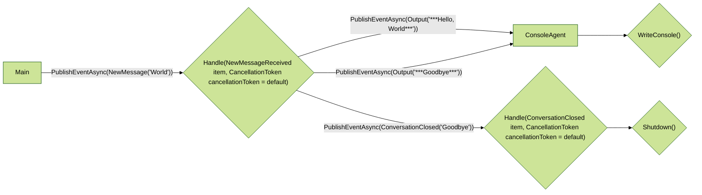

# 읽어보기

- 원문 저장소: `microsoft/autogen`
- 미러 저장소: `martinlee-git/autogen`
- 원문 문서: https://github.com/microsoft/autogen/blob/main/dotnet/samples/Hello/HelloAgent/README.md
- 미러 경로: `dotnet/samples/Hello/HelloAgent/README.md`

## 한글 요약

AutoGen 0.4 .NET Hello World 샘플 이 샘플은 이벤트를 수신한 다음 응답으로 일련의 작업을 조정하는 간단한 .NET 콘솔 애플리케이션을 만드는 방법을 보여줍니다. 전제 조건 이 샘플을 실행하려면 .NET 8.0 이상이 필요합니다. GitHub CLI도 권장됩니다. 샘플 실행 지침 주요 개념 이 샘플은 기본 에이전트에서 상속하고 이벤트를 수신하는 고유한 에이전트를 만드는 방법을 보여줍니다. 또한 SDK의 앱 런타임을 로컬에서 사용하여 에이전트를 시작하고 메시지를 보내는 방법도 보여줍니다. 흐름도: 이벤트 핸들러 작성 자동 생성 애플리케이션의 핵심은 이벤트 핸들러입니다. 에이전트는 특정 주제에 대한 이벤트를 수신하기 위해 를 선택합니다. 이벤트가 수신되면 에이전트의 이벤트 핸들러가 이벤트 데이터와 함께 호출됩니다. 해당 이벤트 핸들러 내에서 선택적으로 새 이벤트를 내보낼 수 있으며, 그런 다음 다른 에이전트가 처리할 수 있도록 이벤트 버스로 전송됩니다. EventTypes는 스키마를 정의하는 데 사용되는 gRPC ProtoBuf 메시지로 선언됩니다.

## 핵심 발췌

이벤트. 기본 proto는 네임스페이스를 통해 사용할 수 있으며 autogen/protos에 정의되어 있습니다. EventType은 인터페이스를 사용하여 에이전트 생성자에 등록됩니다. 상속 및 구성 이 샘플은 AutoGen의 상속도 보여줍니다. HelloAgent 클래스는 WriteConsole 메서드를 제공하는 기본 클래스인 ConsoleAgent에서 상속됩니다. 응용 프로그램 런타임 시작 AuotoGen은 다양한 방법으로 시작할 수 있는 유연한 런타임을 제공합니다. Program.cs 파일은 런타임을 로컬로 시작하고 메서드를 사용하여 한 번에 에이전트에 메시지를 보내는 방법을 보여줍니다. 메시지 보내기 가능한 메시지 세트는 gRPC ProtoBuf 사양에 정의되어 있습니다. 그런 다음 gRPC 도구를 통해 C# 클래스로 변환됩니다. 새로운 .pro 파일을 생성하여 자신만의 메시지 유형을 정의할 수 있습니다.

## 원문 내용

# AutoGen 0.4 .NET Hello World Sample

This [sample](Program.cs) demonstrates how to create a simple .NET console application that listens for an event and then orchestrates a series of actions in response.

## Prerequisites

To run this sample, you'll need: [.NET 8.0](https://dotnet.microsoft.com/en-us/) or later.
Also recommended is the [GitHub CLI](https://cli.github.com/).

## Instructions to run the sample

```bash
# Clone the repository
gh repo clone microsoft/autogen
cd dotnet/samples/Hello
dotnet run
```

## Key Concepts

This sample illustrates how to create your own agent that inherits from a base agent and listens for an event. It also shows how to use the SDK's App Runtime locally to start the agent and send messages.

Flow Diagram:



### Writing Event Handlers

The heart of an autogen application are the event handlers. Agents select a ```TopicSubscription``` to listen for events on a specific topic. When an event is received, the agent's event handler is called with the event data.

Within that event handler you may optionally *emit* new events, which are then sent to the event bus for other agents to process. The EventTypes are declared gRPC ProtoBuf messages that are used to define the schema of the event.  The default protos are available via the ```Microsoft.AutoGen.Contracts;``` namespace and are defined in [autogen/protos](/autogen/protos). The EventTypes are registered in the agent's constructor using the ```IHandle``` interface.

```csharp
TopicSubscription("HelloAgents")]
public class HelloAgent(
    iAgentWorker worker,
    [FromKeyedServices("AgentsMetadata")] AgentsMetadata typeRegistry) : ConsoleAgent(
        worker,
        typeRegistry),
        ISayHello,
        IHandle<NewMessageReceived>,
        IHandle<ConversationClosed>
{
    public async Task Handle(NewMessageReceived item, CancellationToken cancellationToken = default)
    {
        var response = await SayHello(item.Message).ConfigureAwait(false);
        var evt = new Output
        {
            Message = response
        }.ToCloudEvent(this.AgentId.Key);
        await PublishEventAsync(evt).ConfigureAwait(false);
        var goodbye = new ConversationClosed
        {
            UserId = this.AgentId.Key,
            UserMessage = "Goodbye"
        }.ToCloudEvent(this.AgentId.Key);
        await PublishEventAsync(goodbye).ConfigureAwait(false);
    }
```

### Inheritance and Composition

This sample also illustrates inheritance in AutoGen. The `HelloAgent` class inherits from `ConsoleAgent`, which is a base class that provides a `WriteConsole` method.

### Starting the Application Runtime

AuotoGen provides a flexible runtime ```Microsoft.AutoGen.Agents.App``` that can be started in a variety of ways. The `Program.cs` file demonstrates how to start the runtime locally and send a message to the agent all in one go using the ```App.PublishMessageAsync``` method.

```csharp
// send a message to the agent
var app = await App.PublishMessageAsync("HelloAgents", new NewMessageReceived
{
    Message = "World"
}, local: true);

await App.RuntimeApp!.WaitForShutdownAsync();
await app.WaitForShutdownAsync();
```

### Sending Messages

The set of possible Messages is defined in gRPC ProtoBuf specs. These are then turned into C# classes by the gRPC tools. You can define your own Message types by creating a new .proto file in your project and including the gRPC tools in your ```.csproj``` file:

```proto
syntax = "proto3";
package devteam;
option csharp_namespace = "DevTeam.Shared";
message NewAsk {
  string org = 1;
  string repo = 2;
  string ask = 3;
  int64 issue_number = 4;
}
message ReadmeRequested {
   string org = 1;
   string repo = 2;
   int64 issue_number = 3;
   string ask = 4;
}
```

```xml
  <ItemGroup>
    <PackageReference Include="Google.Protobuf" />
    <PackageReference Include="Grpc.Tools" PrivateAssets="All" />
    <Protobuf Include="..\Protos\messages.proto" Link="Protos\messages.proto" />
  </ItemGroup>
```

You can send messages using the [```Microsoft.AutoGen.Agents.AgentWorker``` class](autogen/dotnet/src/Microsoft.AutoGen/Agents/AgentWorker.cs). Messages are wrapped in [the CloudEvents specification](https://cloudevents.io) and sent to the event bus.