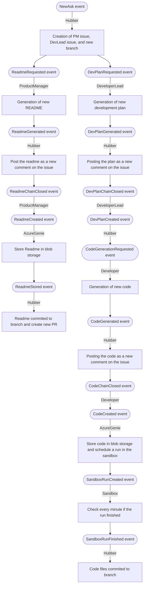

# 읽어보기

- 원문 저장소: `microsoft/autogen`
- 미러 저장소: `martinlee-git/autogen`
- 원문 문서: https://github.com/microsoft/autogen/blob/main/dotnet/samples/dev-team/README.md
- 미러 경로: `dotnet/samples/dev-team/README.md`

## 한글 요약

AI 에이전트가 포함된 GitHub 개발팀 이벤트 기반 에이전트를 사용하여 개발팀을 구축하세요. 이 프로젝트는 실험이며 프로덕션에 사용하기 위한 것이 아닙니다. 배경 자연어 사양에서 기존 저장소의 개별 작업(단위 테스트, 파이프라인 확장, 특정 의도에 대한 PR), 새로운 기능 개발 또는 처음부터 애플리케이션 구축을 위해 AI 에이전트 팀을 팀의 개발 프로세스에 통합하는 작업을 시작합니다. 기존 리포지토리 및 광범위한 의도 설명에서 시작하여 아키텍처, 작업 분류, 개별 작업 계획, 코드 출력, 코드 검토, 효율성, 문서화, 빌드, 테스트 작성, 파이프라인 설정, 배포, 통합 테스트 및 검증에 이르기까지 각각 다른 강조점을 갖는 여러 AI 에이전트와 작업합니다. 시스템은 개발팀 에이전트와 함께 여러 추론 트리에 걸쳐 일련의 사고 조정을 용이하게 하는 뷰를 제공합니다. 실행하기 시작하기 가이드를 확인하세요. 데모 htt

## 핵심 발췌

ps://github.com/microsoft/azure openai 개발자 기술 Orchestrator/assets/10728102/cafb1546 69ab 4c27 aaf5 1968313d637f 솔루션 개요 작동 방법 사용자는 문제를 생성한 다음 달성하려는 내용, 자연 언어를 필요에 따라 간단하거나 자세하게 기술하는 것으로 시작합니다. 제품 관리자 에이전트는 반복할 수 있는 Readme로 응답합니다. 사용자는 Readme를 승인하거나 이슈 댓글을 통해 피드백을 제공합니다. Readme가 승인되면 사용자는 이슈를 닫고 Readme는 PR에 적용됩니다. 개발자 수석 에이전트는 반복할 수 있는 분할된 개발 계획으로 응답합니다. 사용자는 계획을 승인하거나 이슈 댓글을 통해 피드백을 제공합니다. Readme가 승인되면 사용자는 문제를 닫고 계획은 작업을 다른 개발로 분류하는 데 사용됩니다.

## 원문 내용

# GitHub Dev Team with AI Agents

Build a Dev Team using event driven agents. This project is an experiment and is not intended to be used in production.

## Background

From a natural language specification, set out to integrate a team of AI agents into your team’s dev process, either for discrete tasks on an existing repo (unit tests, pipeline expansions, PRs for specific intents), developing a new feature, or even building an application from scratch.  Starting from an existing repo and a broad statement of intent, work with multiple AI agents, each of which has a different emphasis - from architecture, to task breakdown, to plans for individual tasks, to code output, code review, efficiency, documentation, build, writing tests, setting up pipelines, deployment, integration tests, and then validation.
The system will present a view that facilitates chain-of-thought coordination across multiple trees of reasoning with the dev team agents.

## Get it running

Check [the getting started guide](./docs/github-flow-getting-started.md).

## Demo

https://github.com/microsoft/azure-openai-dev-skills-orchestrator/assets/10728102/cafb1546-69ab-4c27-aaf5-1968313d637f

## Solution overview

## How it works

* User begins with creating an issue and then stateing what they want to accomplish, natural language, as simple or as detailed as needed.
* Product manager agent will respond with a Readme, which can be iterated upon.
  * User approves the readme or gives feedback via issue comments.
  * Once the readme is approved, the user closes the issue and the Readme is commited to a PR.
* Developer lead agent responds with a decomposed plan for development, which also can be iterated upon.
  * User approves the plan or gives feedback via issue comments.
  * Once the readme is approved, the user closes the issue and the plan is used to break down the task to different developer agents.
* Developer agents respond with code, which can be iterated upon.
  * User approves the code or gives feedback via issue comments.
  * Once the code is approved, the user closes the issue and the code is commited to a PR.

