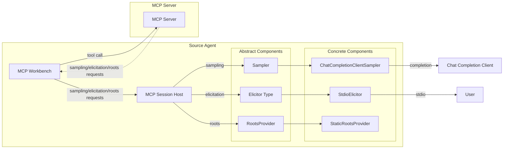
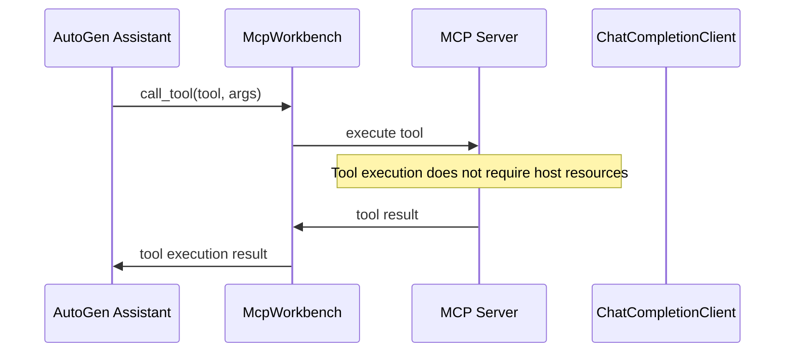
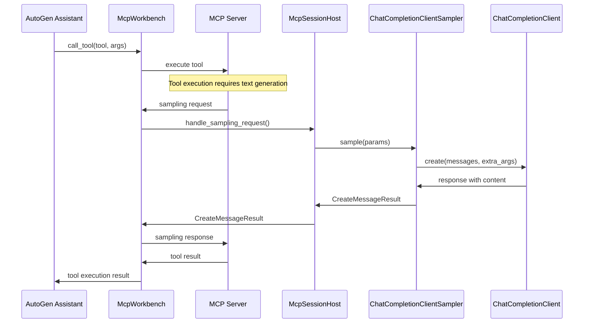
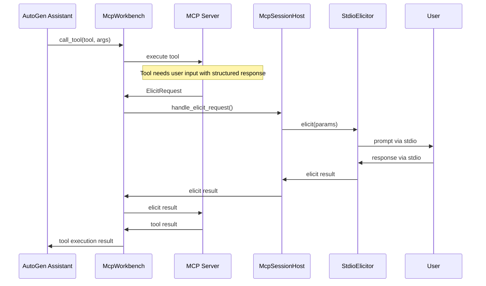
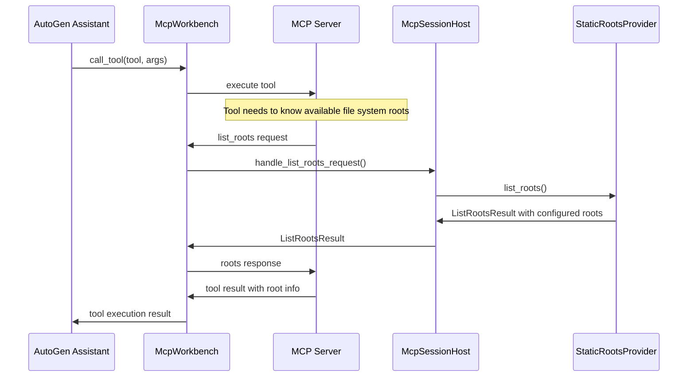

# 읽어보기

- 원문 저장소: `microsoft/autogen`
- 미러 저장소: `martinlee-git/autogen`
- 원문 문서: https://github.com/microsoft/autogen/blob/main/python/packages/autogen-ext/src/autogen_ext/tools/mcp/_host/README.md
- 미러 경로: `python/packages/autogen-ext/src/autogen_ext/tools/mcp/_host/README.md`

## 한글 요약

MCP 세션 호스트 McpSessionHost는 AutoGen 생태계 내에서 MCP 서버 MCP 호스트 요청을 지원합니다. 설계상 AutoGen 에이전트에 대한 변경이 최소화되거나 전혀 필요하지 않으며 McpWorkbench에 호스트를 제공하기만 하면 됩니다. 다음과 같은 MCP 기능이 지원됩니다: 1. 샘플링: 언어 모델을 사용한 텍스트 생성 2. 추출: 대화형 사용자 프롬프트 및 구조화된 데이터 수집 3. 루트: 서버 액세스를 위한 파일 시스템 루트 목록 아키텍처 시퀀스 다이어그램 일반 도구 호출 흐름 샘플링 요청 흐름 추출 요청 흐름 목록 루트 요청 흐름 구성 요소 McpSessionHost 서버에서 호스트 요청을 처리하고 구성 요소 공급자와 조정하는 주요 호스트 측 구성 요소: 샘플러: 샘플러를 통해 샘플링 요청을 처리합니다(예: ChatCompletionClientSampler) Elicitor : Elilicitor(예: StdioElicitor, StreamElicitor)를 통해 추출 요청을 처리합니다. RootsProvider: RootsProvider(예: StaticRootsProvider)를 통해 파일 시스템 액세스 구성을 제공합니다.

## 핵심 발췌

샘플러는 MCP 서버의 텍스트 생성 요청을 처리합니다. ChatCompletionClientSampler: 샘플링 요청을 ChatCompletionClient Elicitor로 라우팅합니다. MCP 서버의 구조화된 프롬프트 요청을 처리합니다. StdioElicitor: 표준 입력/출력 스트림을 통한 대화형 사용자 프롬프트입니다. StreamElicitor: 스트림 기반 추출을 위한 기본 클래스 RootsProviders MCP 서버에 대한 파일 시스템 루트 액세스 관리: StaticRootsProvider: 파일 시스템 루트의 정적 목록 제공 사용 예

## 원문 내용

# MCP Session Host

The `McpSessionHost` supports MCP Server -> MCP Host requests within the AutoGen ecosystem. By design it should require minimal or no changes to your AutoGen agents, simply provide a host to the `McpWorkbench`.

The following MCP features are supported:

1. **Sampling**: Text generation using language models
2. **Elicitation**: Interactive user prompting and structured data collection
3. **Roots**: File system root listing for server access

## Architecture



## Sequence Diagrams

### Normal Tool Calling Flow




### Sampling Request Flow



### Elicitation Request Flow



### List Roots Request Flow



## Components

### McpSessionHost

The main host-side component that handles server-to-host requests and coordinates with component providers:

- **Sampler**: Handles sampling requests via `Sampler`s (e.g. `ChatCompletionClientSampler`)
- **Elicitor**: Handles elicitation requests via `Elicitor`s (e.g. `StdioElicitor`, `StreamElicitor`)
- **RootsProvider**: Provides file system access configuration via `RootsProvider`s (e.g. `StaticRootsProvider`)

### Component Types

#### Samplers
Handle text generation requests from MCP servers:
- **ChatCompletionClientSampler**: Routes sampling requests to any `ChatCompletionClient`

#### Elicitors
Handle structured prompting requests from MCP servers:
- **StdioElicitor**: Interactive user prompting via standard input/output streams.
- **StreamElicitor**: Base class for stream-based elicitation

#### RootsProviders
Manage file system root access for MCP servers:
- **StaticRootsProvider**: Provides a static list of file system roots

## Usage

### Example

```diff
from autogen_agentchat.agents import AssistantAgent, UserProxyAgent
from autogen_agentchat.teams import RoundRobinGroupChat
from autogen_ext.models.openai import OpenAIChatCompletionClient
from autogen_ext.tools.mcp import McpWorkbench, StdioServerParams
+ from autogen_ext.tools.mcp import (
+     ChatCompletionClientSampler,
+     McpSessionHost,
+     StaticRootsProvider,
+     StdioElicitor,
+ )
+ from pydantic import FileUrl
+ from mcp.types import Root

# Setup model client
model_client = OpenAIChatCompletionClient(model="gpt-4o")

+ # Create components
+ sampler = ChatCompletionClientSampler(model_client)
+ elicitor = StdioElicitor()
+ roots = StaticRootsProvider([
+     Root(uri=FileUrl("file:///workspace"), name="Workspace"),
+     Root(uri=FileUrl("file:///docs"), name="Documentation"),
+ ])

+ # Create host with all capabilities
+ host = McpSessionHost(
+     sampler=sampler,    # For sampling requests
+     elicitor=elicitor,  # For elicitation requests
+     roots=roots,        # For roots requests
+ )

# Setup MCP workbench
mcp_workbench = McpWorkbench(
    server_params=StdioServerParams(
        command="python",
        args=["your_mcp_server.py"]
    ),
+     host=host,
)

# Create MCP-enabled assistant
assistant = AssistantAgent(
    "assistant",
    model_client=model_client,
    workbench=mcp_workbench,
)
```